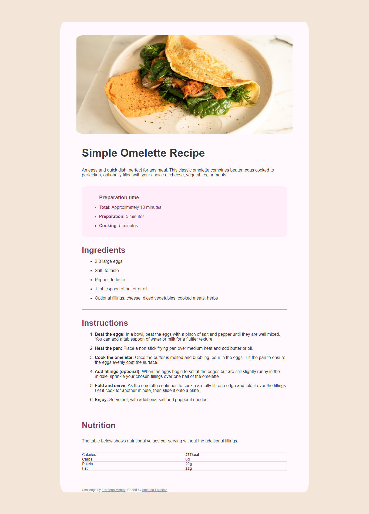

# Frontend Mentor - Recipe page solution

This is a solution to the [Recipe page challenge on Frontend Mentor](https://www.frontendmentor.io/challenges/recipe-page-KiTsR8QQKm). 

## Table of contents

  - [The challenge] https://www.frontendmentor.io/challenges/recipe-page-KiTsR8QQKm
- [My process] few hours
  - [Built with] HTML and CSS
- [Author] Amanda
- [Acknowledgments] HTML, CSS and responsive

## Overview

### Screenshot

### Built with

- Semantic HTML5 markup
- CSS custom properties
- CSS Grid

## Author

- Website - [Amanda](https://www.your-site.com)
- Linkedin - [Amanda](https://www.frontendmentor.io/profile/yourusername)

